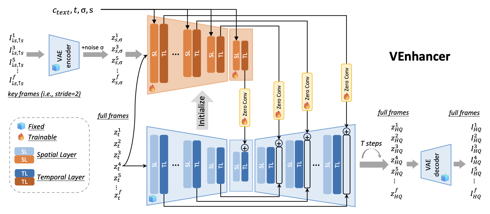

<div align="center">

<h1>VEnhancer: Generative Space-Time Enhancement<br>for Video Generation</h1>

<div>
    <a href='https://scholar.google.com/citations?user=GUxrycUAAAAJ&hl=zh-CN' target='_blank'>Jingwen He</a>,&emsp;
    <a href='https://tianfan.info' target='_blank'>Tianfan Xue</a>,&emsp;
    <a href='https://github.com/ChrisLiu6' target='_blank'>Dongyang Liu</a>,&emsp;
    <a href='https://github.com/0x3f3f3f3fun' target='_blank'>Xinqi Lin</a>,&emsp;
</div>
    <a href='https://gaopengcuhk.github.io' target='_blank'>Peng Gao</a>,&emsp;
    <a href='https://scholar.google.com/citations?user=GMzzRRUAAAAJ&hl=en' target='_blank'>Dahua Lin</a>,&emsp;
    <a href='https://scholar.google.com/citations?user=gFtI-8QAAAAJ&hl=en' target='_blank'>Yu Qiao</a>,&emsp;
    <a href='https://wlouyang.github.io' target='_blank'>Wanli Ouyang</a>,&emsp;
    <a href='https://liuziwei7.github.io' target='_blank'>Ziwei Liu</a>
<div>
</div>
<div>
    The Chinese University of Hong Kong,&emsp;Shanghai Artificial Intelligence Laboratory,&emsp; 
</div>
<div>
    
</div>
<div>
 S-Lab, Nanyang Technological University&emsp; 
</div>

<div>
    <h4 align="center">
        <a href="https://vchitect.github.io/VEnhancer-project/" target='_blank'>
        
        </a>
        <a href="https://arxiv.org/abs/2407.07667" target='_blank'>
        
        </a>
        <a href="https://youtu.be/QMR_5weifGg" target='_blank'>
        
        <!-- </a>
         -->
    </h4>
</div>

<strong>VEnhancer, a generative space-time enhancement framework that can improve the existing T2V results. </strong>

<table class="center">
  <tr>
    <td colspan="1">VideoCrafter2</td>
    <td colspan="1">+VEnhancer</td>
  </tr>
  <tr>
  <td>
    
  </td>
  <td>
    
  </td>
  </tr>
  <tr>
  <td>
    
  </td>
  <td>
    
  </td>
  </tr>

  

</table>

:open_book: For more visual results, go checkout our <a href="https://vchitect.github.io/VEnhancer-project/" target="_blank">project page</a>


---

</div>


## 🔥 Update
- [2024.07.28] Inference code and pretrained video enhancement model are released.
- [2024.07.10] This repo is created.

## 🎬 Overview
The architecture of VEnhancer. It follows ControlNet and copies the architecures and weights of  multi-frame  encoder and middle block of a pretrained video diffusion model to build a trainable condition network. 
This video ControlNet accepts low-resolution key frames as well as full frames of noisy latents as inputs. 
Also, the noise level $\sigma$ regarding noise augmentation and downscaling factor $s$ serve as additional network conditioning apart from timestep $t$ and prompt $c_{text}$. 



## :gear: Installation
```shell
# clone this repo
git clone https://github.com/Vchitect/VEnhancer.git
cd VEnhancer

# create environment
conda create -n venhancer python=3.10
conda activate venhancer
pip install torch==2.0.1 torchvision==0.15.2 torchaudio==2.0.2
pip install -r requirements.txt
```
Note that ffmpeg command should be enabled. If you have sudo access, then you can install it using the following command:
```shell
sudo apt-get update && apt-get install ffmpeg libsm6 libxext6  -y
```

## :dna: Pretrained Models
| Model Name | Description | HuggingFace | BaiduNetdisk  |
| :---------: | :----------: | :----------: | :----------: | 
| venhancer_paper.pth  | video enhancement model, paper version | [download](https://huggingface.co/jwhejwhe/VEnhancer/resolve/main/venhancer_paper.pt) | [download](https://pan.baidu.com/s/15t20RGvEHqJOMmhA_zRLiA?pwd=cpsd)|

## 💫 Inference 
1) Download clip model via [open clip](https://huggingface.co/laion/CLIP-ViT-H-14-laion2B-s32B-b79K/resolve/main/open_clip_pytorch_model.bin), Stable Diffusion's VAE via [sd2.1](https://huggingface.co/stabilityai/stable-diffusion-2-1-base/resolve/main/v2-1_512-ema-pruned.ckpt), and VEnhancer model. Then, put these three checkpoints in the `VEnhancer/ckpts` directory.
2) run the following command.
```bash
  bash run_VEnhancer.sh
```

## BibTeX
If you use our work in your research, please cite our publication:
```
@article{he2024venhancer,
  title={VEnhancer: Generative Space-Time Enhancement for Video Generation},
  author={He, Jingwen and Xue, Tianfan and Liu, Dongyang and Lin, Xinqi and Gao, Peng and Lin, Dahua and Qiao, Yu and Ouyang, Wanli and Liu, Ziwei},
  journal={arXiv preprint arXiv:2407.07667},
  year={2024}
}
```

## 🤗 Acknowledgements
Our codebase builds on [modelscope](https://github.com/modelscope/modelscope). 
Thanks the authors for sharing their awesome codebases! 

## 📧 Contact
If you have any questions, please feel free to reach us at `hejingwenhejingwen@outlook.com`.
